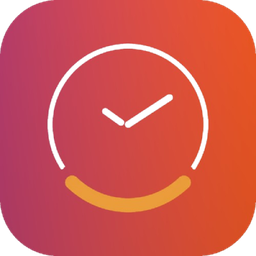

<div align="center">



# Cadran

**A clock on your wallpaper.**

22 hand-crafted clock faces rendered directly on your macOS desktop - behind your icons, always visible, never intrusive.

[Website](https://cadranapp.com) &nbsp;&middot;&nbsp; [Download](https://cadranapp.com/api/download/latest) &nbsp;&middot;&nbsp; [Report a Bug](https://github.com/Ilyomix/Cadran-releases/issues/new?template=bug_report.yml) &nbsp;&middot;&nbsp; [Request a Feature](https://github.com/Ilyomix/Cadran-releases/issues/new?template=feature_request.yml)


[](https://github.com/jaywcjlove/awesome-mac/pull/1914#event-24241286709)

</div>

---

## What is Cadran?

Cadran transforms your Mac desktop into a beautiful, always-visible clock. Pick from **22 uniquely designed faces** - analog, numeric, abstract, matrix, data-driven, and color-mapped - each crafted to complement your workspace, not compete with it.

### Highlights

- **Wallpaper-layer rendering** - lives behind your icons, not on top
- **Dynamic sky backgrounds** that shift with real sunrise and sunset
- **Live weather** overlays (temperature, wind, conditions)
- **41 curated backgrounds** - solids, gradients, and dynamic sky
- **Per-monitor faces** - assign a different face to each display
- **Native screensaver mode** - your clock face, fullscreen
- **Energy-optimized** - pauses automatically when hidden

### Privacy-first

No accounts. No ads. No telemetry. Everything stays on your Mac.

### Pricing

| | Free | Pro ($9.99 one-time) |
|---|---|---|
| Clock faces | 6 | All 22 + future additions |
| Backgrounds | Presets | Full palette |
| Screensaver | Yes | Yes |
| Per-monitor | - | Yes |

---

## Download

Grab the latest release:

**[Download Cadran.dmg](https://cadranapp.com/api/download/latest)**

> Requires **macOS Sonoma 14.0** or later. Works on Apple Silicon and Intel.

---

## Feedback & Issues

This repository is the public issue tracker for Cadran. The source code is private, but you can report bugs and request features here.

### Using GitHub Issues (Web)

1. Go to the [**Issues** tab](https://github.com/Ilyomix/Cadran-releases/issues)
2. Click **New Issue**
3. Choose a template: **Bug Report** or **Feature Request**
4. Fill in the details and submit

### Using the `gh` CLI

If you have the [GitHub CLI](https://cli.github.com) installed, you can file issues directly from your terminal:

```bash
# Report a bug
gh issue create --repo Ilyomix/Cadran-releases \
  --template bug_report.yml \
  --title "Brief description of the bug"

# Request a feature
gh issue create --repo Ilyomix/Cadran-releases \
  --template feature_request.yml \
  --title "Brief description of the feature"

# Quick issue (no template)
gh issue create --repo Ilyomix/Cadran-releases \
  --title "Your title" \
  --body "Describe the issue or idea"
```

> **Tip:** Run `gh issue list --repo Ilyomix/Cadran-releases` to check existing issues before creating a new one.

### Before submitting

- Search [existing issues](https://github.com/Ilyomix/Cadran-releases/issues) to avoid duplicates
- Include your **macOS version** and **Cadran version** for bug reports
- One issue per report - it helps us track and resolve things faster

---

## Links

- [Website](https://cadranapp.com)
- [Privacy Policy](https://cadranapp.com/privacy)
- [Support](https://cadranapp.com/support)

---

<div align="center">
<sub>Made by <a href="https://github.com/Ilyomix">Ilyes Abd-Lillah</a> in Toulouse, France.</sub>
</div>
